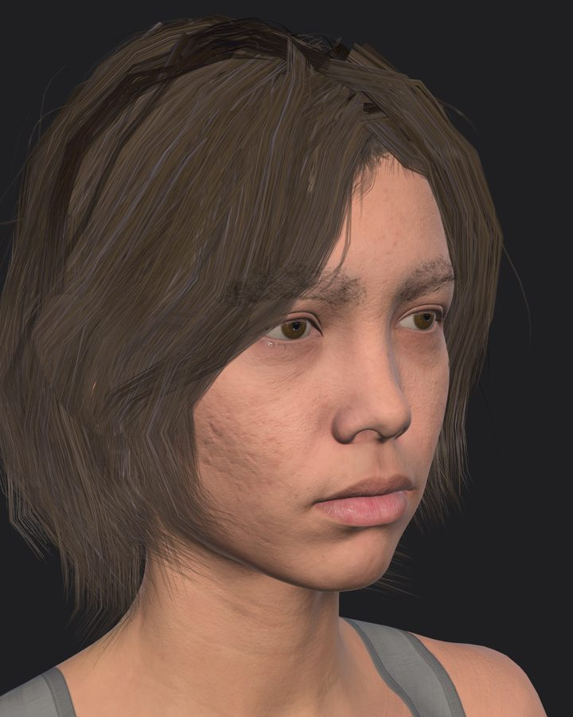
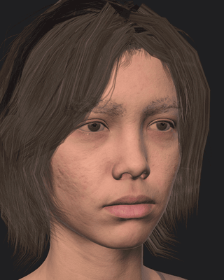
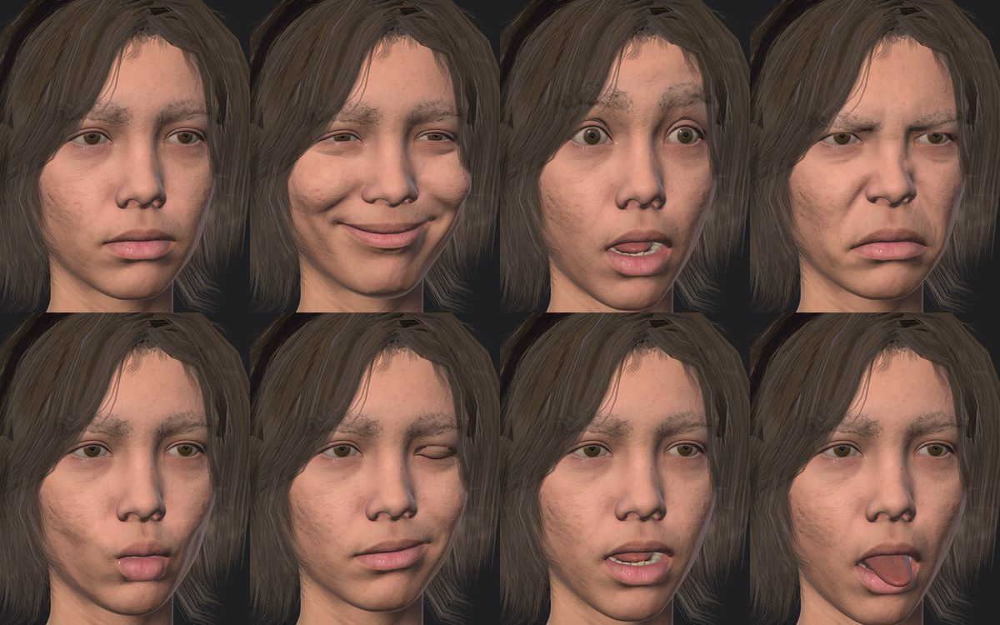

# metahuman-to-vrchat

Turn your own MetaHuman into a VRChat avatar whose face follows a webcam.

<p>
  
  
</p>

I made a MetaHuman in Unreal Engine 5.6, baked its RigLogic face into 172 blendshapes in Blender, set it up in Unity with Jerry's ARKit face-tracking template, and drove it in VRChat with my laptop webcam through FoxyFace and VRCFaceTracking. This repo holds the tools and the write-up so you can do the same with your MetaHuman.

It contains no MetaHuman assets and not my avatar. You bring your own ([why](LICENSE-AUDIT.md)).

## Quick start

| | Step | Time |
| --- | --- | --- |
| 1 | Install the tools and accounts ([list](docs/01-prerequisites.md)) | once |
| 2 | In Unreal: make your MetaHuman, export DNA, textures and hair cards ([how](docs/02-unreal-export.md)) | 30 min after the face is done |
| 3 | Build the FBX and textures with one command ([details](docs/03-build.md)) | 2 min |
| 4 | In Unity: add the package, copy the files in, one menu click, upload ([details](docs/04-unity-vrchat.md)) | 20 min |
| 5 | Connect the webcam tracking ([details](docs/05-face-tracking.md)) | 30 min |

Step 3:

```bat
pip install -r requirements.txt
python build.py my_metahuman\config.toml
```

Step 4, Unity Package Manager > Add package from git URL:

```
https://github.com/Ducklexander/metahuman-to-vrchat.git?path=/unity/com.ducklexander.metahuman-vrchat
```

Then select `Avatar.fbx` and run **Tools > MetaHuman to VRChat > Set Up Avatar**.

Something looks wrong: [troubleshooting](docs/06-troubleshooting.md). Why things are done this way, and what failed on the way: [notes](docs/notes.md).



## Limits

- **PC only, Very Poor Performance Rank.** 110,616 triangles. The head carries the blendshapes and cannot be reduced without losing facial detail. Every other stat is Good or Excellent. [Details](docs/04-unity-vrchat.md#performance-rank)
- **Webcam tracking works in desktop mode only.** A headset covers your face.
- **Face tracking is connected but not yet calibrated.** The eyes look half closed with default settings; [status](docs/05-face-tracking.md#calibration).
- **Tested on one Windows 11 laptop** with Unity 2022.3.22f1, Blender 5.1.0, Poly Hammer Character DNA 0.12.4 and FoxyFace 1.0.5.1. Newer addon and FoxyFace versions are untested.
- Hair is game-style hair cards with a painted atlas, not Unreal's strand hair.

## What is in the repo

| Folder | Contents |
| --- | --- |
| `build.py`, `config.example.toml` | The one-command build |
| `blender/` | Headless RigLogic bake: DNA in, VRChat-ready FBX out. Checks its own output in a clean Blender |
| `tools/textures/` | Texture repacking, normal map flip, painted hair/lash/brow atlas |
| `unity/` | Unity editor package: import settings, Poiyomi presets, avatar setup, pre-upload check |
| `tools/tracking/` | Port check and OSC recorder for the webcam chain |
| `docs/` | Step-by-step chapters, notes, and the [verification record](docs/verification.md) |

## Why this works now

In June 2025 Epic put MetaHuman under the Unreal Engine EULA and allowed MetaHumans in other engines, so a MetaHuman in VRChat is permitted. The technical problem is that VRChat animates faces with blendshapes, while a MetaHuman face is RigLogic: mostly joints, plus correctives that depend on which controls are active. The Poly Hammer Blender addon runs RigLogic inside Blender, so the rig can be posed once per expression and the result stored. That bake is the core of this repo. Against live RigLogic the largest error I measured was 0.00036 mm, and running these tools on my archived export reproduces the FBX I uploaded bit for bit ([verification](docs/verification.md)).

## License

MIT for everything in this repo ([LICENSE](LICENSE)). MetaHuman, Unreal Engine and third-party packages are under their own terms and are not included.

Not affiliated with or endorsed by Epic Games, VRChat, Poly Hammer, or the authors of the other tools named here.
