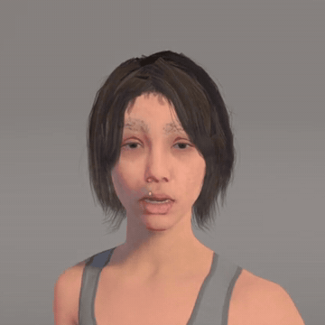

# metahuman-to-vrchat

A MetaHuman as a VRChat avatar, with the face driven by a webcam.



I made a MetaHuman in Unreal Engine 5.6, baked its RigLogic face into 172 blendshapes in Blender, set it up in Unity with Jerry's ARKit face-tracking template, and drove it in VRChat with my laptop webcam through FoxyFace and VRCFaceTracking. These are the tools I used, cleaned up so they work with any MetaHuman. MetaHuman files are not included; you export your own.

## Steps

1. Install the software and set up the accounts: [prerequisites](docs/01-prerequisites.md)
2. Make your MetaHuman in Unreal and export the DNA, textures and hair cards: [Unreal export](docs/02-unreal-export.md)
3. Build the FBX and textures:

   ```bat
   pip install -r requirements.txt
   python build.py my_metahuman\config.toml
   ```

   Details: [build](docs/03-build.md)
4. In a VRChat avatar project (Unity 2022.3.22f1), add the package from this git URL, copy in the FBX and textures, then run **Tools > MetaHuman to VRChat > Set Up Avatar** and upload: [Unity and VRChat](docs/04-unity-vrchat.md)

   ```
   https://github.com/Ducklexander/metahuman-to-vrchat.git?path=/unity/com.ducklexander.metahuman-vrchat#v0.1.0
   ```

5. Connect the webcam tracking: [face tracking](docs/05-face-tracking.md)

## Where the Unity project and .blend files are

Neither is in this repo, because both contain the MetaHuman itself.

- **.blend files:** `build.py` writes them into your `work/` folder. `checkpoint_riglogic.blend` is the last state where RigLogic still runs (open it to try expressions); `merged.blend` is the finished avatar just before the FBX export.
- **Unity project:** you create it in the VRChat Creator Companion in step 4. The package in `unity/` does the setup inside it.

## Limits

- PC only, and the Performance Rank is **Very Poor** because of the triangle count (110,616). The face needs all of them for the blendshapes; everything else rates Good or Excellent.
- Webcam tracking only works in desktop mode.
- FoxyFace is not calibrated yet in my setup; the eyes look a bit too closed.
- Only tested on Windows 11 with Unity 2022.3.22f1, Blender 5.1.0, Poly Hammer Character DNA 0.12.4 and FoxyFace 1.0.5.1.

## License

MIT. MetaHuman, Unreal Engine and the third-party packages have their own licenses and are not included. Not affiliated with Epic Games or VRChat.
