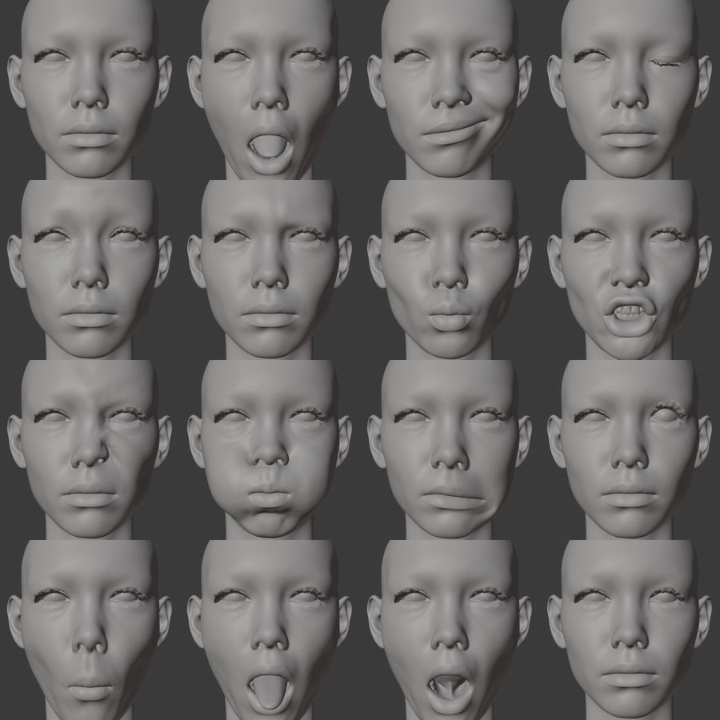

# 3. Build the avatar files

One command turns your Unreal export into the FBX and textures Unity needs. About 2 minutes on my laptop.

## Steps

1. Install the Python packages once:

   ```bat
   pip install -r requirements.txt
   ```

2. Copy `config.example.toml` into your export folder as `config.toml` and edit the paths (Blender, DNA, textures, hair). Relative paths are resolved from the config file's folder.

3. Run:

   ```bat
   python build.py my_metahuman\config.toml
   ```

The output lands in `my_metahuman\work\`:

| File | What it is |
| --- | --- |
| `Avatar.fbx` | One mesh named `Body` with 172 blendshapes, 55-bone Humanoid skeleton, 7 material slots |
| `Textures\` | 18 PNG files for the 7 materials |
| `bake_report.md` | Every check, plus the mapping from each blendshape to RigLogic controls |

## Check

The Blender part ends with a line like this, read back from the FBX in a separate, clean Blender:

```
[mh2vrc] 173 shape keys incl. Basis | ARKit 52/52 | visemes 15/15 | 110,616 tris | 7 material slots | 55 bones
```

Your triangle count depends on your body, hair and eyebrows. The other numbers should be the same. `bake_report.md` should say `pass` on every line.

Add `--qa` to also render contact sheets of the baked shapes into `work\qa\`. In them, left-side shapes such as `mouthSmileLeft` should move only the character's own left side.



## Changing an expression

The blendshape recipes are in `blender/mh2vrc/bake_expressions.py`: each entry is a shape name and the RigLogic controls it sets. After editing, rebuild from the saved checkpoint, which skips the DNA import:

```bat
python build.py my_metahuman\config.toml --only blender --from-bake
```

For an automatic blink when face tracking is off, set `add_vrc_blink = true` under `[bake]` and rebuild the same way. Untested in VRChat.

## If it fails

| Message or symptom | Fix |
| --- | --- |
| `Set the path to blender.exe` | Fill in `[blender] exe`, or pass `--blender` |
| `Poly Hammer 'Character DNA' extension not found` | Install it in that Blender ([prerequisites](01-prerequisites.md#poly-hammer-character-dna)) |
| `body.dna must sit next to head.dna` | Save both DNA files into the same folder |
| `missing in ...: ['T_Head_BC.png', ...]` | Export the listed textures ([chapter 2](02-unreal-export.md#3-baked-textures)) |
| `no *_Cavity.png` | Run Save Face Textures in MetaHuman Creator |
| Warning that the addon version is untested | You have a Poly Hammer version newer than 0.12.4. It may work; read the report carefully |
| Tracebacks at startup naming other add-ons | Another Blender extension is broken on 5.1. Harmless here |
| Hair is neutral brown | No `hair_params` file. See [chapter 2](02-unreal-export.md#hair-colour) |

