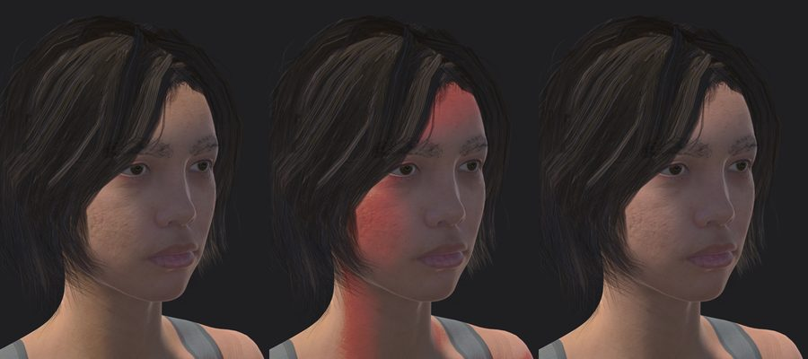

# Notes: why it works this way

The step chapters say what to do. This page says why, and what went wrong on the way. Nearly every item here failed without an error message at least once.

## Blender bake

### The idea

VRChat animates faces with blendshapes. A MetaHuman face is RigLogic: about 80% of every expression comes from roughly 870 facial joints, the rest from corrective shapes that RigLogic mixes in depending on which controls are active. The bake poses the rig once per expression, reads the fully deformed mesh (shape keys and armature both applied) and stores `base + (posed - rest)` as a shape key. Subtracting the evaluated rest pose cancels a 0.04 mm round-trip error in the joint transforms, so a shape at 0 is identical to the basis.

I baked 172 shapes: ARKit 52, 15 visemes, 55 Unified Expressions extras, 38 MetaHuman-only controls and 12 emotion presets. Against live RigLogic the worst error I measured was 0.00036 mm.

"New Shape From Mix", the obvious Blender tool, gives the wrong answer: it mixes only the existing shape keys and ignores the armature.

### Three silent bugs in the free Poly Hammer addon (0.12.4)

1. `import_shape_keys=True` does nothing; nothing in the addon reads it. Without the corrective shapes, expressions lose lip roll, eyelid creases and cheek compression. The pipeline reads the correctives from the DNA with the addon's bundled `dna` bindings.
2. `import_normals=True` scrambles the normals (scaled like positions, no Y-up to Z-up swap), and the face renders as speckled noise. The pipeline imports without them; smooth shading is what the DNA intends.
3. The addon's fast shape-key update allocates a buffer sized to the shape-key count at plan time. Baking adds shape keys, so from the second shape on, every write fails with `internal error setting the array`, on stderr only. My first bake produced 169 shapes where only the first had correctives. The pipeline sets the corrective values itself.

### Other details

- Some controls move nothing on a neutral face: lips-together acts only with an open jaw, lid-press only with a closed eye. Those shapes are baked as differences (`mouthClose = evaluated(jawOpen + lipsTogether) - evaluated(jawOpen)`), which is how ARKit defines them.
- The pipeline drives RigLogic's raw controls and holds the addon's depsgraph evaluation off, because the addon re-derives raw controls from the face board on every update.
- Left and right were measured: driving `eyeLookLeftL` moves the left pupil 8.95 mm toward the character's own left. In MetaHuman names the word is the direction and the trailing `L`/`R` is the eye.
- I wanted Epic's `PA_MetaHuman_ARKit_Mapping` as the reference, but UE 5.6's Python API cannot read its curve values. The table is built from Poly Hammer's FACS reference poses, one-to-one control matches and a few commented combinations.
- `SoftPalateClose` is the one Unified shape I could not make: the LOD0 head has no soft palate.
- The head and body rigs disagree below `spine_04` by up to 18 mm (the addon synthesises the head rig's lower spine), so the body rig is the reference and only the eye joints come from the head rig. The spine goes from 5 bones to 3 and the neck from 2 to 1, because Unity's Humanoid wants an unbroken mapped chain. Dropped bones hand their weights to the nearest parent; the rest pose moved 0.039 mm (head) and 0.104 mm (body).

### Why the triangle count stays high

The head, teeth, eyes and lashes carry the blendshapes (61,534 triangles in my run) and Blender refuses to decimate meshes with shape keys. The body takes the whole reduction (60,816 to 28,000) and hair uses the artist-made LOD1 cards (18,738 instead of 34,093). The only way further down is decimating the head before the bake, which costs facial detail.

## Textures

- **Normal maps need their green channel flipped.** Unreal uses DirectX (green down), Unity OpenGL (green up). My plan said otherwise. I settled it with a statistical test: skin detail is mostly pits, so the height field recovered from a correct normal map has a positively skewed Laplacian, and the horizontal half of the Laplacian is independent of the convention and serves as a control. `T_Head_N`: control +0.239, DirectX +0.202, OpenGL -0.018. `T_Body_N`: control +0.408, DirectX +4.48, OpenGL -3.26. Do not flip again in Unity.
- **Computed colours must be encoded to sRGB.** My first hair atlas wrote linear values straight into the PNG; they were decoded twice and the hair looked silver. After fixing that, the hair looked blond because the preview light was far too bright. The two errors had been cancelling out.
- **Unreal has no hair texture to export.** Its hair shader is procedural. The pipeline paints a strand atlas and remaps every card onto it. Each card has its own UV sliver (median 0.045 x 0.476), cell shapes match the card shapes (hair 10:1, lashes 6:1, brows 0.75:1), and the root end of each card is found from geometry (37 of 1,153 hair cards, 2 of 936 brow cards and 43 of 211 lash cards needed flipping). The eyelashes are built like hair cards, so they share the hair material; that saves a material slot.
- **Eyebrows are the hard part.** 936 overlapping brow cards become a black slab if each is slightly too opaque, or look bald if too thin. I tuned by measuring average alpha per zone: hair 0.49, lashes 0.08, brows 0.09.
- MetaHuman's body texture has a grey tank top and shorts painted in, so the avatar is not unclothed.
- The body UVs sit in UDIM tile 1 (U 1 to 2). The pipeline moves them into 0 to 1 so Clamp wrap cannot break them.

## Unity and VRChat

- **`useFileScale` must stay on.** The FBX header says centimetres, the vertices are metres and the nodes carry a 100x scale; file scale 0.01 cancels it. I once turned it off and the avatar was 170 m tall. Side effect: `Armature` and `Body` have a lossy scale of 100, so PhysBone radii need dividing by 100.
- **Read/Write and Streaming Mip Maps** are SDK errors when off, not warnings.
- **Blend Shape Normals = Import** keeps the normals the FBX carries per shape. The price is a slow import (467 to 478 s here) because MikkTSpace runs once per shape. `None` would save 13 MB of 146 MB.
- **Do not build blendshapes in Unity.** I tried adding `vrc.blink` in an AssetPostprocessor; one import went from 8 minutes to more than 90 without finishing. Add shapes in Blender.
- **Poiyomi's toon defaults ignore world lighting.** `_LightingIgnoreAmbientColor` 1 makes shadows take the direct light colour; `_LightingCastedShadows` 0 blocks world shadows; `_LightingIndirectUsesNormals` 0 removes all direction from ambient light; `_LightingCap` 1 stops bright worlds from brightening the avatar. With defaults, a blue and a warm world changed the cheek colour by at most 0.04 per channel; with the preset values about 10 times more.
- **`_DetailNormalMap` needs `_DetailEnabled = 1`.** Without it the pore normal changed 0% of the pixels, and Poiyomi's lock step stripped the texture. I had judged it "clearly working" by eye; that was the base normal map. Fixed, it changed 61.89%.
- **Locked materials are what ships.** Poiyomi compiles each material into its own shader when you upload. Property edits after that do nothing (except `[DoNotLock]` ones). Once the lock skipped `Eye_L` and `Eye_R`, and the eyes were solid magenta in VRChat. The package's build hook now stops a test or upload build if anything is unlocked.
- **The skin LUT I removed.** My original build used a pre-integrated scattering LUT. I measured it as changing 0.06% of the pixels, on the unlocked material. Locked, it painted the shadowed cheek and neck red: my LUT normalised each texel by its brightest channel, which turns "almost no light" into "full red". The avatar I uploaded has this; the tools no longer use the LUT.

  

- **`VF_EyeRotation` doubles eye movement.** Jerry's ARKit template moves the eyes with blendshapes in its FX layer, and `VF_EyeRotation` moves the eye bones from the same parameters. The setup removes it. When tracking is off, the template hands the eyes back to VRChat and the bone-based Eye Look works.
- **Scripted builds stop at dialogs.** Thry's "Automatic Lighting Fix" and Unity's Save Scene dialog both block a build started from a script, with no log output and no CPU use.
- **Re-uploads need a new thumbnail.** VRChat's file API rejects a byte-identical file, and fails after the bundle is already uploaded (`This file was already uploaded`).
- **Driving the editor from scripts or an AI assistant:** long calls can time out on the caller's side while Unity keeps working, and some tools resend the command. One timed-out reimport queued three extra 8-minute reimports for me. Check `Editor.log` before retrying.

## Measuring

Decide whether something works by measuring it, and measure the thing that ships. The pore normal (first 0%) and the LUT (harmless unlocked, red once locked) both contradicted what I saw by eye. To decide whether an object renders at all, give it a saturated unlit colour and count those pixels; I once reached four wrong conclusions in a row by adjusting the lighting on an object that was never drawn.
